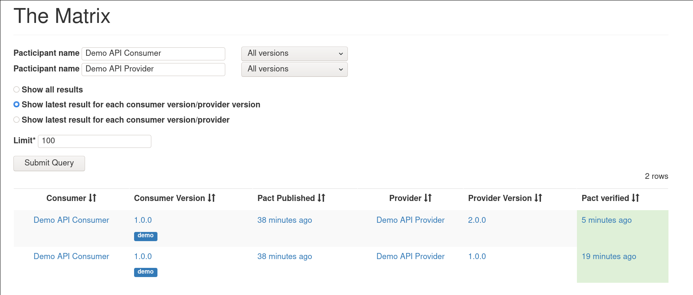

# Pact Consumer Demo

An example repo that shows a consumer of an api and the provider of that API being integrated with a locally hosted Pact Broker.

_Step 1:_ Run the Pact Broker

_Step 2:_ Run the consumer tests (publishing the pact contract)

_Step 3:_ Run the provider tests (verifying the provider)

_Step 4:_ Take a look at the pact broker

You can modify the provider and increment the provider version get a demo of the Pact Matrix

The same example is available in Typescript and Node JS. Just pick whichever you prefer!

## Consumer

The consumer is written to look similar to an AWS Lambda function. When invoked it will make an external API request to the Demo Provider API.

To run the unit tests for the consumer, from the consumer directory run:
- `npm run test:unit`

To run the pact contract tests for the consumer, from the consumer directory run:
- `npm run test:contract`

## Provider

The provider is a demo express app that is configured to run locally on port 8080. It has a single endpoint that provides some arbitrary data that the consumer is expecting to be there.

the provider can be validated against the consumer defined contract by running the provider contract tests; From the Provider directory run:
- `npm run test:contract`

## Pact Broker

A docker compose file is included that will let you spin up an instance of the the pact broker.

you can start this by running `docker-compose up` from the Pact Broker directory. By default the broker will be running on `localhost:9292`

from the pact broker you can see what contracts the consumer has published for its providers and what versions of providers have validated against those contracts

### Pacts

### Pact Matrix

